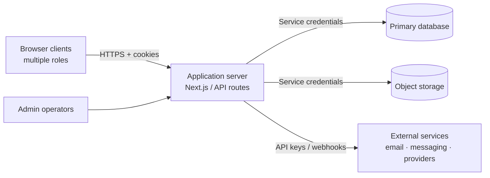

# Pagoda Travel — Application Security Assessment

###### Document classification: **Confidential — Internal / Vendor**
###### Assessment type: Architecture & control review (point-in-time)
###### Prepared as: Independent application security engineer review
###### Audience: Engineering leadership, product owners, compliance stakeholders

:::info
**How to read this document**  
This is written from an **external security engineer’s** perspective after a limited review of the application architecture, auth boundaries, and integration surface. It is **not** a full penetration test, and it does **not** claim complete knowledge of every product workflow. Findings are prioritized by realistic attacker impact, not by feature completeness.
:::

---

## Table of Contents

[TOC]

---

## 1. Executive Summary

Pagoda Travel operates a multi-role web platform connecting travel professionals and service providers, with server-rendered and API-driven application flows, cloud-hosted data, object storage, and several third-party integrations that process personal and operational data.

From a security engineering standpoint, the system’s risk profile is dominated by:

1. **Trust in application-layer authorization** while the data plane is accessed with elevated backend privileges  
2. **Custom session / cookie-based identity** spanning multiple roles  
3. **Privileged administrative capabilities** (including identity assumption)  
4. **Sensitive integration channels** (messaging, email, booking/provider APIs, file exchange)

Controls already present (role gates, object-level access helpers, content sanitization in messaging, approval gates for untrusted accounts) are directionally correct. The residual risk is less about “missing a feature,” and more about **consistency of enforcement**, **session integrity**, **auditability of privileged actions**, and **data exposure via storage and integrations**.

:::warning
**Bottom line**  
The platform is not “unsafe by design,” but it is a **high-trust application server** pattern: if route-level authorization or session handling is wrong once, the blast radius is large because the backend can reach broad data. That pattern is common and acceptable — if compensated by rigorous authz tests, least privilege, and monitoring.
:::

---

## 2. Scope & Assumptions

### 2.1 In scope

| Area | Coverage |
|------|----------|
| Application architecture | Next.js app + first-party API routes |
| Identity & access | Cookie session model, role separation, admin privilege paths |
| Data plane | Primary database + object storage usage patterns |
| Integrations | Third-party booking/provider, messaging, email |
| Sensitive workflows | Account approval, impersonation/admin access, file upload/download |

### 2.2 Out of scope (this pass)

- Full source-assisted penetration test / red team
- Infrastructure hardening of the cloud account (IAM, network ACLs, WAF rulesets)
- Supplier SOC2 / ISO evidence review
- Mobile client assessment (if any native apps exist beyond the web app)
- Legal/privacy opinion (GDPR DPIA, etc.) — security notes only

### 2.3 Working assumptions

A security engineer reviewing this class of system typically knows:

- There are **multiple actor types** (marketplace-style: demand side, supply side, operators/admins)
- Users create and exchange **itinerary / job / profile** style business objects
- There is **chat / messaging**, **document or media upload**, and **email notifications**
- At least one **external provider API** is involved in bookings or transfers
- Exact product catalog, pricing rules, and every UI flow are **not** fully known — and do not need to be known to assess the security architecture

:::success
**Assessment principle**  
Security review focuses on **assets, trust boundaries, and failure modes**, not on documenting the product roadmap.
:::

---

## 3. Methodology

| Phase | Activity |
|-------|----------|
| Discovery | Map auth entry points, middleware posture, API auth pattern, privileged roles |
| Threat modeling | STRIDE-style pass over identity, data, integrations, admin paths |
| Control review | Compare observed controls against OWASP ASVS L2 expectations (selected) |
| Risk rating | Likelihood × impact, with emphasis on confidentiality of PII and privilege escalation |
| Recommendations | Prioritized backlog suitable for engineering sprint planning |

**Standard references used:** OWASP Top 10 (2021), OWASP ASVS 4.x (selected), NIST SP 800-63B (session concepts), CIS guidance for cloud app backends.

---

## 4. System Understanding (Limited)

The following reflects what a security engineer can reasonably infer without claiming complete product knowledge.

### 4.1 Observed architectural pattern

| Component | Security-relevant note |
|-----------|------------------------|
| Web application | Server-side routes and UI share one deployment unit |
| API surface | First-party JSON APIs; authorization largely **per-route** |
| Middleware | Protects many page routes; API auth is **route-owned** |
| Database access | Backend commonly uses **elevated/service credentials** |
| Object storage | Multiple buckets for media/docs; signed URL patterns present |
| Roles | Distinct role cookies / claims (e.g. marketplace sides + admin) |
| Privileged ops | Admin can assume another user’s session context (impersonation-style) |

### 4.2 Assets worth protecting

1. **Account credentials & session cookies**  
2. **Personal data** of travelers and professionals (contact, docs, media)  
3. **Business objects** (itineraries, assignments, pricing-sensitive data)  
4. **Integration secrets** (provider keys, SMTP, messaging tokens)  
5. **Admin privilege** (platform-wide visibility and control)

---

## 5. Threat Model (Condensed)

| Threat | Example attacker goal | Primary controls expected |
|--------|----------------------|---------------------------|
| Account takeover | Steal/forge session; reset abuse | Hardened cookies, rate limits, MFA for privileged roles |
| Broken object-level auth (BOLA) | Read/modify another org’s records via ID guessing | Consistent ownership checks on every mutating/read API |
| Privilege escalation | Agent → admin, or abuse impersonation | Strict admin auth, audit log, short-lived assume-role |
| Data exfiltration via storage | Guess/leak signed URLs; overly public objects | Short TTL, private buckets, authz before sign |
| Injection / XSS via UGC | Stored payloads in chat, profiles, uploads | Output encoding, upload type checks, CSP |
| Integration abuse | Replay webhooks; scrape provider data | Signature verification, idempotency, least privilege keys |
| Insider / admin misuse | Silent access to user accounts | Impersonation banners, immutable audit trail |

---

## 6. Findings

Severity scale: **Critical / High / Medium / Low / Informational**.

:::warning
Severities below are **architectural risk ratings** based on observed patterns. They are not proof of exploitable bugs until validated by testing.
:::

### F-01 — Application-enforced authorization with elevated data credentials — **High**

**Observation**  
The application server appears to access the primary datastore with **service-level privileges**. Correctness of every API’s authorization check is therefore a hard security dependency.

**Why it matters**  
A single missed `owner_id` / role check can expose cross-tenant data. This is the dominant failure mode for “BFF + service role” designs.

**Recommendation**  
- Treat authorization helpers as a **security library**, not convenience utilities  
- Add automated tests for **negative cases** (wrong role, wrong object id, cross-user)  
- Prefer DB policies (RLS) or constrained roles for defense in depth where feasible  
- Periodically inventory `/api/*` routes for missing auth wrappers

---

### F-02 — Custom cookie session model — **High** (verify)

**Observation**  
Identity appears carried primarily via **HTTP-only cookies** (`session` / role / user identifiers). Page middleware enforces some routes; APIs enforce independently.

**Why it matters**  
Custom sessions are fine when:
- session tokens are **opaque, server-validated, rotatable**
- cookies are `Secure`, `HttpOnly`, appropriate `SameSite`
- logout / compromise invalidates server-side state

If cookies are largely “asserted” without strong server-side binding, session fixation or cookie forgery risk rises.

**Recommendation**  
- Confirm every sensitive API **re-validates** session against server state (not cookie presence alone)  
- Bind sessions to user id + role; rotate on login and privilege change  
- Shorten idle lifetime for admin sessions; consider absolute timeouts  
- Add MFA for admin (and ideally for high-value accounts)

---

### F-03 — Administrative impersonation / “access as user” — **High**

**Observation**  
A privileged path allows operators to operate in another user’s context. This is valuable for support, and dangerous if weakly audited.

**Why it matters**  
Impersonation collapses accountability unless every action is attributable to **admin actor + target user**.

**Recommendation**  
- Immutable audit log: who, whom, when, reason, actions performed  
- UI banner always visible during impersonation; hard to miss  
- Block impersonation of other admins (or require dual control)  
- Prefer short-lived assume-role tokens over long cookie swaps  
- Alerting on impersonation start/stop

---

### F-04 — API authorization consistency (route-by-route) — **Medium–High**

**Observation**  
`/api/*` relies on per-handler checks rather than a single gateway policy.

**Why it matters**  
In growing codebases, new endpoints occasionally ship with incomplete checks. This is a process risk as much as a code risk.

**Recommendation**  
- Shared `requireSession` / `requireRole` / `assertObjectAccess` on **all** handlers  
- Lint or CI check for routes that omit the shared helpers  
- Threat-model new endpoints in PR template (“authz matrix” checkbox)

---

### F-05 — Object storage & signed URL exposure — **Medium**

**Observation**  
Multiple storage buckets hold avatars, documents, media, and business files. Signed URL generation is used in places.

**Why it matters**  
Long-lived or guessable URLs become durable exfiltration channels. Public buckets amplify impact.

**Recommendation**  
- Default **private** buckets; sign on demand with short TTL  
- Authorize **before** signing (same object ACL as the API)  
- Virus/malware scanning for document uploads where practical  
- Content-type allowlists; block HTML/SVG where XSS via content is relevant  
- Review CORS and cache headers on sensitive objects

---

### F-06 — Messaging / contact-data leakage — **Medium**

**Observation**  
Messaging exists across roles; sanitization of sensitive contact patterns appears intentional in chat flows.

**Why it matters**  
Marketplace platforms often leak phone/email/social handles, enabling off-platform fraud or privacy violations.

**Recommendation**  
- Keep sanitization on **write and read** paths  
- Monitor bypass attempts (encoding tricks, image OCR is out of band — accept residual)  
- Rate-limit conversation creation and message volume  
- Clear retention policy for message history

---

### F-07 — Third-party integrations (booking / messaging / email) — **Medium**

**Observation**  
External providers are used for operational workflows (bookings/transfers, WhatsApp-class messaging, SMTP mail).

**Why it matters**  
Secrets, webhook authenticity, and over-broad API scopes are classic breach amplifiers.

**Recommendation**  
- Secrets only in environment / secret manager; never in client bundles  
- Verify webhook signatures; reject unsigned replay  
- Least-privilege API keys; rotate on schedule and on staff change  
- Separate staging vs production credentials  
- Log provider callbacks with correlation IDs (no secrets in logs)

---

### F-08 — Account approval / onboarding gates — **Low–Medium** (positive control)

**Observation**  
Unapproved professional accounts appear gated before full activity.

**Why it matters**  
Reduces spam, fraud, and drive-by abuse of marketplace actions.

**Recommendation**  
- Ensure gates apply to **APIs**, not only UI  
- Review approval workflow for social-engineering of admins  
- Time-box pending accounts; auto-expire stale registrations

---

### F-09 — Security headers / browser hardening — **Informational → Medium** (verify in prod)

**Recommendation checklist**  
- CSP (start report-only, then enforce)  
- `X-Content-Type-Options: nosniff`  
- Frame protections (`frame-ancestors`)  
- HSTS on the primary domain  
- Careful cookie `SameSite` vs cross-site needs

---

## 7. Positive Controls Observed

Credit where due — these reduce risk today:

| Control | Comment |
|---------|---------|
| Role segmentation | Distinct actor types reduce accidental privilege mix-ups |
| Object access helpers | Centralized itinerary/job-style ownership checks (where used) |
| Activity approval gate | Limits untrusted accounts before full platform use |
| Message sanitization | Shows awareness of off-platform contact leakage |
| HttpOnly cookies | Correct baseline against trivial XSS cookie theft |
| Admin identity checks | Admin actions appear bound to active admin records |

---

## 8. Recommended Roadmap

### P0 — Next 30 days

- [ ] Session validation audit: prove every sensitive API re-checks server-side session  
- [ ] Impersonation audit log + alerting  
- [ ] Negative authz test pack for top 20 APIs (cross-user IDOR suite)  
- [ ] Secret inventory & rotation for integration keys  

### P1 — Next 60–90 days

- [ ] Defense-in-depth DB policies or constrained DB roles where practical  
- [ ] Storage ACL review + signed URL TTL standardization  
- [ ] Admin MFA  
- [ ] CSP rollout (report-only → enforce)  
- [ ] Webhook signature verification review for all inbound providers  

### P2 — Ongoing

- [ ] Quarterly dependency vulnerability triage  
- [ ] Annual external penetration test (web + API)  
- [ ] Tabletop: account compromise + impersonation abuse scenarios  
- [ ] Privacy retention alignment for chat, docs, and booking payloads  

---

## 9. Residual Risk Statement

Even with the recommendations above fully implemented, residual risk remains:

- Determined attackers with stolen session cookies  
- Insider abuse by privileged operators  
- Zero-days in frameworks or upstream providers  
- Social engineering of support/admin staff  

Acceptable residual risk should be explicitly owned by leadership after P0 items are closed.

---

## 10. Appendix A — Suggested Evidence Pack (for auditors)

If you need to show due diligence later, keep:

1. AuthN/AuthZ design note (session lifecycle diagram)  
2. Impersonation policy + sample audit records  
3. API authorization test results (CI screenshots)  
4. Secret rotation log  
5. Penetration test report + remediation tracker  
6. Incident response runbook (contact tree, revoke sessions procedure)

---

## 11. Appendix B — Severity Definitions

| Severity | Meaning |
|----------|---------|
| Critical | Direct, reliable path to mass data breach or full platform takeover |
| High | Likely path to significant confidentiality/integrity impact |
| Medium | Realistic abuse path with meaningful but limited blast radius |
| Low | Defense-in-depth gap or hardening improvement |
| Informational | Observation / best practice |

---

## Document Control

| Field | Value |
|-------|-------|
| Version | 1.0 |
| Status | Draft for engineering review |
| Next review | After P0 remediation or ≤ 6 months |
| Distribution | Engineering · Product · Security owners only |

:::info
**Author note (security engineer voice)**  
I have not treated this as a product walkthrough. I treated it as a system that holds other people’s travel and business data, with multiple trust boundaries. Fix the **session and authorization spine** first; features will keep changing, but those two controls determine whether growth increases risk linearly or catastrophically.
:::

---

*End of assessment.*
